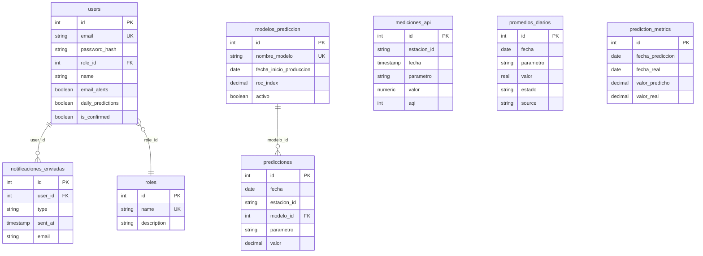

# 🗄️ DOCUMENTACIÓN DEL ESQUEMA DE BASE DE DATOS - AIR GIJÓN

## 🎯 RESUMEN EJECUTIVO

Este documento describe en detalle el esquema completo de la base de datos PostgreSQL del sistema de monitoreo de calidad del aire de Gijón, incluyendo su evolución histórica, relaciones, índices y consideraciones de rendimiento.

### Estado Actual
- ✅ **Base de datos**: PostgreSQL en Render (Producción) y localhost (Desarrollo)
- ✅ **Tablas activas**: 8 tablas principales + 1 tabla de parámetros
- ✅ **Sistema de roles**: Completamente normalizado
- ✅ **Migraciones**: Todas aplicadas exitosamente
- ✅ **Índices**: Optimizados para consultas frecuentes

---

## 🏗️ ARQUITECTURA GENERAL

### Entornos de Base de Datos

#### **Producción (Render)**
```
Host: PostgreSQL Managed Service
URL: DATABASE_URL (variable de entorno)
SSL: Obligatorio con rejectUnauthorized: false
Conexiones: Pool de conexiones automático
```

#### **Desarrollo (Local)**
```
Host: localhost:5432
Database: air_gijon_local
Usuario: sergio
Password: air
SSL: Deshabilitado
```

### Configuración de Conexión
```javascript
const pool = new Pool({
  connectionString: process.env.DATABASE_URL,
  ssl: process.env.NODE_ENV === 'production' ? { rejectUnauthorized: false } : false
});
```

---

## 📊 TABLAS PRINCIPALES

### 1. 👥 **TABLA: users**

#### Estructura
```sql
CREATE TABLE users (
  id SERIAL PRIMARY KEY,
  email VARCHAR(255) UNIQUE NOT NULL,
  password_hash VARCHAR(255) NOT NULL,
  role_id INTEGER REFERENCES roles(id) ON DELETE CASCADE,
  name VARCHAR(255),
  created_at TIMESTAMP WITH TIME ZONE DEFAULT CURRENT_TIMESTAMP,
  updated_at TIMESTAMP WITH TIME ZONE DEFAULT CURRENT_TIMESTAMP,
  email_notifications_active BOOLEAN DEFAULT TRUE,
  daily_predictions BOOLEAN DEFAULT TRUE,
  is_confirmed BOOLEAN DEFAULT FALSE,
  confirmation_token VARCHAR(255),
  confirmation_token_expires_at TIMESTAMP WITH TIME ZONE,
  last_login TIMESTAMP WITH TIME ZONE,
  email_alerts BOOLEAN DEFAULT TRUE,
  reset_password_token VARCHAR(255),
  reset_password_token_expires_at TIMESTAMP WITH TIME ZONE
);
```

#### Campos Clave
- **id**: Clave primaria autoincremental
- **email**: Email único del usuario (índice único)
- **password_hash**: Contraseña hasheada con bcrypt (salt rounds: 10-12)
- **role_id**: Referencia a tabla roles (1=usuario, 2=admin)
- **email_alerts**: Control individual de alertas por PM2.5
- **daily_predictions**: Control individual de predicciones diarias
- **is_confirmed**: Estado de confirmación de email
- **confirmation_token**: Token temporal para confirmación de email

#### Índices
```sql
CREATE INDEX idx_users_email ON users(email);
CREATE INDEX idx_users_role ON users(role_id);
CREATE INDEX idx_users_created_at ON users(created_at);
CREATE INDEX idx_users_email_notifications_active ON users(email_notifications_active);
CREATE INDEX idx_users_confirmation_token ON users(confirmation_token);
```

#### Triggers
```sql
-- Trigger para actualizar updated_at automáticamente
CREATE TRIGGER update_user_updated_at
BEFORE UPDATE ON users
FOR EACH ROW EXECUTE FUNCTION update_updated_at_column();
```

### 2. 🎭 **TABLA: roles**

#### Estructura
```sql
CREATE TABLE roles (
  id SERIAL PRIMARY KEY,
  name VARCHAR(50) UNIQUE NOT NULL,
  description TEXT,
  created_at TIMESTAMP WITH TIME ZONE DEFAULT CURRENT_TIMESTAMP
);
```

#### Datos Iniciales
```sql
INSERT INTO roles (id, name, description) VALUES 
(1, 'user', 'Usuario estándar con acceso a funcionalidades básicas'),
(2, 'admin', 'Administrador del sistema con acceso completo');
```

#### Índices
```sql
CREATE INDEX idx_roles_name ON roles(name);
```

### 3. 📊 **TABLA: mediciones_api**

#### Estructura
```sql
CREATE TABLE mediciones_api (
  id SERIAL PRIMARY KEY,
  estacion_id VARCHAR(50) NOT NULL,
  fecha TIMESTAMP NOT NULL,
  parametro VARCHAR(20) NOT NULL,
  valor NUMERIC,
  aqi INTEGER,
  is_validated BOOLEAN DEFAULT FALSE,
  created_at TIMESTAMP DEFAULT CURRENT_TIMESTAMP,
  updated_at TIMESTAMP DEFAULT CURRENT_TIMESTAMP,
  
  -- Restricción para evitar duplicados
  UNIQUE(estacion_id, fecha, parametro)
);
```

#### Campos Clave
- **estacion_id**: Identificador de estación (ej: '6699' para Avenida Constitución)
- **fecha**: Timestamp de la medición (precisión horaria)
- **parametro**: Tipo de contaminante ('pm25', 'pm10', 'o3', 'no2', 'so2', 'co')
- **valor**: Valor numérico de la medición
- **aqi**: Índice de Calidad del Aire (Air Quality Index)
- **is_validated**: Indicador de validación de datos

#### Índices
```sql
CREATE INDEX idx_mediciones_api_fecha ON mediciones_api(fecha);
CREATE INDEX idx_mediciones_api_estacion ON mediciones_api(estacion_id);
CREATE INDEX idx_mediciones_api_parametro ON mediciones_api(parametro);
```

#### Trigger de Actualización
```sql
CREATE OR REPLACE FUNCTION update_mediciones_api_timestamp()
RETURNS TRIGGER AS $$
BEGIN
    NEW.updated_at = CURRENT_TIMESTAMP;
    RETURN NEW;
END;
$$ LANGUAGE plpgsql;

CREATE TRIGGER update_mediciones_api_timestamp
BEFORE UPDATE ON mediciones_api
FOR EACH ROW EXECUTE FUNCTION update_mediciones_api_timestamp();
```

### 4. 📈 **TABLA: promedios_diarios**

#### Estructura
```sql
CREATE TABLE promedios_diarios (
  id SERIAL PRIMARY KEY,
  fecha DATE NOT NULL,
  parametro VARCHAR(20) NOT NULL,
  valor REAL,
  estado TEXT,
  source TEXT DEFAULT 'calculated' NOT NULL,
  detalles TEXT,
  created_at TIMESTAMP WITH TIME ZONE DEFAULT CURRENT_TIMESTAMP,
  updated_at TIMESTAMP WITH TIME ZONE DEFAULT CURRENT_TIMESTAMP,
  
  -- Clave única para un dato, de una fuente, para un parámetro en una fecha
  UNIQUE(fecha, parametro, source)
);
```

#### Campos Clave
- **fecha**: Fecha del promedio (tipo DATE, sin hora)
- **parametro**: Contaminante ('pm25', 'pm10', etc.)
- **valor**: Valor promedio diario
- **estado**: Estado calculado según normativas ('Buena', 'Regular', 'Insalubre')
- **source**: Origen del dato ('calculated', 'csv_historical', 'mediciones_api')
- **detalles**: Información adicional en formato JSON

#### Fuentes de Datos (source)
- **'calculated'**: Promedio calculado desde datos horarios
- **'csv_historical'**: Datos históricos importados desde CSV
- **'mediciones_api'**: Promedio calculado desde API AQICN

#### Índices
```sql
CREATE INDEX idx_promedios_fecha ON promedios_diarios(fecha);
CREATE INDEX idx_promedios_parametro ON promedios_diarios(parametro);
CREATE INDEX idx_promedios_source ON promedios_diarios(source);
CREATE INDEX idx_promedios_fecha_parametro ON promedios_diarios(fecha, parametro);
```

### 5. 🤖 **TABLA: modelos_prediccion**

#### Estructura
```sql
CREATE TABLE modelos_prediccion (
  id SERIAL PRIMARY KEY,
  nombre_modelo VARCHAR(100) NOT NULL UNIQUE,
  fecha_inicio_produccion DATE NOT NULL,
  fecha_fin_produccion DATE,
  roc_index DECIMAL(5,4),
  descripcion TEXT,
  activo BOOLEAN DEFAULT false,
  created_at TIMESTAMP DEFAULT CURRENT_TIMESTAMP,
  updated_at TIMESTAMP DEFAULT CURRENT_TIMESTAMP
);
```

#### Campos Clave
- **nombre_modelo**: Identificador único del modelo (ej: 'Modelo_1.0')
- **fecha_inicio_produccion**: Cuando el modelo empezó a usarse
- **fecha_fin_produccion**: Cuando se dejó de usar (NULL si está activo)
- **roc_index**: Métrica de precisión del modelo (ROC AUC)
- **activo**: Booleano que indica si es el modelo actual

#### Modelo Actual
```sql
-- Modelo activo en producción
INSERT INTO modelos_prediccion VALUES (
  3, 'Modelo_1.0', '2025-06-15', NULL, 8.3700, 
  'LightGBM con 33 variables meteorológicas y de calidad del aire', 
  true, '2025-06-15 10:00:00', '2025-06-15 10:00:00'
);
```

#### Índices
```sql
CREATE INDEX idx_modelos_activo ON modelos_prediccion(activo);
CREATE INDEX idx_modelos_fechas ON modelos_prediccion(fecha_inicio_produccion, fecha_fin_produccion);
```

### 6. 🔮 **TABLA: predicciones**

#### Estructura
```sql
CREATE TABLE predicciones (
  id SERIAL PRIMARY KEY,
  fecha DATE NOT NULL,
  estacion_id VARCHAR(20) NOT NULL,
  modelo_id INTEGER NOT NULL REFERENCES modelos_prediccion(id),
  parametro VARCHAR(20) NOT NULL,
  valor DECIMAL(10,4) NOT NULL,
  fecha_generacion TIMESTAMP DEFAULT CURRENT_TIMESTAMP,
  created_at TIMESTAMP DEFAULT CURRENT_TIMESTAMP,
  
  -- Evitar duplicados para misma fecha/estación/modelo/parámetro
  UNIQUE(fecha, estacion_id, modelo_id, parametro)
);
```

#### Campos Clave
- **fecha**: Fecha para la cual se predice
- **estacion_id**: Estación de monitoreo ('6699' = Avenida Constitución)
- **modelo_id**: Referencia al modelo usado para la predicción
- **parametro**: Contaminante predicho (principalmente 'pm25')
- **valor**: Valor predicho en µg/m³
- **fecha_generacion**: Cuándo se generó la predicción

#### Índices
```sql
CREATE INDEX idx_predicciones_fecha ON predicciones(fecha);
CREATE INDEX idx_predicciones_estacion_fecha ON predicciones(estacion_id, fecha);
CREATE INDEX idx_predicciones_parametro_fecha ON predicciones(parametro, fecha);
CREATE INDEX idx_predicciones_modelo_fecha ON predicciones(modelo_id, fecha);
```

### 7. 📋 **TABLA: prediction_metrics**

#### Estructura
```sql
CREATE TABLE prediction_metrics (
  id SERIAL PRIMARY KEY,
  fecha_prediccion DATE NOT NULL,
  fecha_real DATE NOT NULL,
  valor_predicho DECIMAL(5,2) NOT NULL,
  valor_real DECIMAL(5,2) NOT NULL,
  modelo_version VARCHAR(50) NOT NULL DEFAULT 'Modelo Predictivo 0.0',
  error_absoluto DECIMAL(5,2) GENERATED ALWAYS AS (ABS(valor_predicho - valor_real)) STORED,
  error_relativo DECIMAL(5,2) GENERATED ALWAYS AS (ABS(valor_predicho - valor_real) / NULLIF(valor_real, 0) * 100) STORED,
  created_at TIMESTAMP DEFAULT CURRENT_TIMESTAMP,
  
  UNIQUE(fecha_prediccion, fecha_real, modelo_version)
);
```

#### Campos Calculados
- **error_absoluto**: Calculado automáticamente como |predicho - real|
- **error_relativo**: Calculado automáticamente como porcentaje de error

### 8. 📧 **TABLA: notificaciones_enviadas**

#### Estructura
```sql
CREATE TABLE notificaciones_enviadas (
  id SERIAL PRIMARY KEY,
  user_id INTEGER NOT NULL REFERENCES users(id) ON DELETE CASCADE,
  type VARCHAR(50) NOT NULL,
  sent_at TIMESTAMP WITH TIME ZONE DEFAULT CURRENT_TIMESTAMP,
  email VARCHAR(255) NOT NULL,
  subject VARCHAR(255),
  content TEXT,
  status VARCHAR(20) DEFAULT 'sent',
  
  -- Campos específicos para alertas de mediciones
  fecha_medicion TIMESTAMP, 
  estacion_id VARCHAR(50),
  parametro VARCHAR(20),
  valor_medicion REAL,

  -- Restricciones de integridad
  CONSTRAINT chk_measurement_data_for_alerts
    CHECK ( (type = 'alert' AND fecha_medicion IS NOT NULL AND estacion_id IS NOT NULL AND parametro IS NOT NULL) OR (type != 'alert') ),
      
  CONSTRAINT chk_welcome_reset_no_measurement
    CHECK ( 
      (type NOT IN ('welcome', 'password_reset', 'prediction')) OR 
      (fecha_medicion IS NULL AND estacion_id IS NULL AND parametro IS NULL) 
    )
);
```

#### Tipos de Notificaciones
- **'alert'**: Alertas automáticas por calidad del aire
- **'prediction'**: Predicciones diarias
- **'welcome'**: Email de bienvenida
- **'password_reset'**: Recuperación de contraseña

#### Índices
```sql
CREATE UNIQUE INDEX idx_notificaciones_medicion_unica 
ON notificaciones_enviadas (user_id, fecha_medicion, estacion_id, parametro, type) 
WHERE fecha_medicion IS NOT NULL AND estacion_id IS NOT NULL AND parametro IS NOT NULL;

CREATE INDEX idx_notificaciones_user_type_date 
ON notificaciones_enviadas (user_id, type, sent_at);

CREATE INDEX idx_notificaciones_fecha_medicion 
ON notificaciones_enviadas (fecha_medicion) WHERE fecha_medicion IS NOT NULL;

CREATE INDEX idx_notificaciones_parametro 
ON notificaciones_enviadas (parametro) WHERE parametro IS NOT NULL;
```

### 9. 🏭 **TABLA: parametros_aire**

#### Estructura
```sql
CREATE TABLE parametros_aire (
  id SERIAL PRIMARY KEY,
  codigo VARCHAR(10) UNIQUE NOT NULL,
  nombre VARCHAR(100) NOT NULL,
  descripcion TEXT,
  unidad VARCHAR(20) NOT NULL,
  categoria VARCHAR(50) DEFAULT 'contaminante',
  activo BOOLEAN DEFAULT true,
  created_at TIMESTAMP DEFAULT NOW()
);
```

#### Datos de Parámetros
```sql
INSERT INTO parametros_aire (codigo, nombre, descripcion, unidad, categoria) VALUES
('PM25', 'Partículas en Suspensión <2,5 µm', 'Partículas en suspensión con diámetro aerodinámico menor a 2,5 micrómetros', 'µg/m³', 'contaminante'),
('PM10', 'Partículas en suspensión <10 µm', 'Partículas en suspensión con diámetro aerodinámico menor a 10 micrómetros', 'µg/m³', 'contaminante'),
('NO2', 'Concentración de NO2', 'Dióxido de nitrógeno', 'µg/m³', 'contaminante'),
('O3', 'Concentración de Ozono', 'Ozono troposférico', 'µg/m³', 'contaminante'),
('SO2', 'Concentración de SO2', 'Dióxido de azufre', 'µg/m³', 'contaminante'),
('CO', 'Concentración de CO', 'Monóxido de carbono', 'mg/m³', 'contaminante'),
('TMP', 'Temperatura Seca', 'Temperatura del aire seco', 'ºC', 'meteorologico'),
('HR', 'Humedad relativa', 'Humedad relativa del aire', '%hr', 'meteorologico'),
('PRB', 'Presion Atmosferica', 'Presión barométrica', 'mb', 'meteorologico'),
('VV', 'Velocidad del viento', 'Velocidad del viento', 'm/s', 'meteorologico'),
('DD', 'Direccion del viento', 'Dirección del viento', 'Grados', 'meteorologico'),
('LL', 'Precipitacion', 'Precipitación acumulada', 'l/m²', 'meteorologico'),
('RS', 'Radiacion Solar', 'Radiación solar', 'W/m²', 'meteorologico');
```

#### Categorías
- **contaminante**: Parámetros de calidad del aire
- **meteorologico**: Variables meteorológicas

#### Índices
```sql
CREATE INDEX idx_parametros_codigo ON parametros_aire(codigo);
CREATE INDEX idx_parametros_categoria ON parametros_aire(categoria);
CREATE INDEX idx_parametros_activo ON parametros_aire(activo);
```

---

## 🔗 RELACIONES ENTRE TABLAS

### Diagrama de Relaciones



### Relaciones Principales

#### **1. users ↔ roles** (Muchos a Uno)
```sql
users.role_id → roles.id
```
- Un usuario tiene un rol
- Un rol puede tener muchos usuarios

#### **2. users ↔ notificaciones_enviadas** (Uno a Muchos)
```sql
notificaciones_enviadas.user_id → users.id
```
- Un usuario puede tener muchas notificaciones
- Cada notificación pertenece a un usuario
- **CASCADE DELETE**: Si se elimina usuario, se eliminan sus notificaciones

#### **3. modelos_prediccion ↔ predicciones** (Uno a Muchos)
```sql
predicciones.modelo_id → modelos_prediccion.id
```
- Un modelo puede generar muchas predicciones
- Cada predicción está asociada a un modelo

#### **4. Relaciones Implícitas por Datos**
- **mediciones_api ↔ promedios_diarios**: Por estacion_id, fecha, parametro
- **promedios_diarios ↔ predicciones**: Por fecha, parametro (datos históricos → predicciones)

---

## 🔄 EVOLUCIÓN HISTÓRICA DEL ESQUEMA

### Fase 1: Sistema Básico (Inicios de 2025)
```sql
-- Estructura original simple
CREATE TABLE users (
  id SERIAL PRIMARY KEY,
  email VARCHAR(255) UNIQUE,
  password_hash VARCHAR(255),
  role VARCHAR(20) CHECK (role IN ('external', 'manager'))
);
```

### Fase 2: Normalización de Roles (Junio 2025)
```sql
-- Migración a sistema de roles normalizado
-- Scripts de migración ejecutados:
-- - migrate_roles_system.js
-- - migrate_roles_production.js

-- Cambios principales:
ALTER TABLE users ADD COLUMN role_id INTEGER REFERENCES roles(id);
ALTER TABLE users DROP COLUMN role;
```

### Fase 3: Sistema de Notificaciones (Junio 2025)
```sql
-- Agregado control granular de notificaciones
ALTER TABLE users ADD COLUMN email_alerts BOOLEAN DEFAULT TRUE;
ALTER TABLE users ADD COLUMN daily_predictions BOOLEAN DEFAULT TRUE;

-- Tabla de logs de notificaciones
CREATE TABLE notificaciones_enviadas (...);
```

### Fase 4: Sistema de Predicciones ML (Junio 2025)
```sql
-- Separación de datos históricos y predicciones
CREATE TABLE modelos_prediccion (...);
CREATE TABLE predicciones (...);

-- Refactorización de promedios_diarios
-- De estructura desnormalizada a normalizada por parámetro
```

### Fase 5: Estado Actual (Junio 2025)
- ✅ Sistema de roles completamente funcional
- ✅ Control granular de notificaciones
- ✅ Arquitectura de predicciones ML escalable
- ✅ Datos históricos y en tiempo real integrados

---

## 📈 CONSIDERACIONES DE RENDIMIENTO

### Índices Estratégicos

#### **Consultas Frecuentes Optimizadas:**

1. **Login de usuarios**:
```sql
-- Optimizado con índice único en email
SELECT * FROM users WHERE email = ?;
```

2. **Datos PM2.5 recientes**:
```sql
-- Optimizado con índice compuesto
SELECT * FROM promedios_diarios 
WHERE parametro = 'pm25' AND fecha >= ? 
ORDER BY fecha;
```

3. **Predicciones actuales**:
```sql
-- Optimizado con índices en fecha y modelo_id
SELECT * FROM predicciones p
JOIN modelos_prediccion m ON p.modelo_id = m.id
WHERE m.activo = true AND p.fecha >= CURRENT_DATE;
```

4. **Usuarios para notificaciones**:
```sql
-- Optimizado con índices en preferencias
SELECT * FROM users 
WHERE email_alerts = true AND is_confirmed = true;
```

### Restricciones de Integridad

#### **Claves Únicas Compuestas:**
```sql
-- Evitar datos duplicados por fecha/parámetro/fuente
UNIQUE(fecha, parametro, source) -- promedios_diarios

-- Evitar duplicados de medición horaria
UNIQUE(estacion_id, fecha, parametro) -- mediciones_api

-- Evitar predicciones duplicadas
UNIQUE(fecha, estacion_id, modelo_id, parametro) -- predicciones
```

#### **Constraints de Validación:**
```sql
-- Solo alertas tienen datos de medición
CONSTRAINT chk_measurement_data_for_alerts
CHECK ( (type = 'alert' AND fecha_medicion IS NOT NULL) OR (type != 'alert') )

-- Emails deben ser únicos
CONSTRAINT users_email_key UNIQUE (email)
```

### Triggers Automáticos

#### **Actualización de Timestamps:**
```sql
-- Función reutilizable para updated_at
CREATE OR REPLACE FUNCTION update_updated_at_column()
RETURNS TRIGGER AS $$
BEGIN
    NEW.updated_at = CURRENT_TIMESTAMP;
    RETURN NEW;
END;
$$ language 'plpgsql';

-- Aplicado a múltiples tablas
CREATE TRIGGER update_user_updated_at
BEFORE UPDATE ON users FOR EACH ROW EXECUTE FUNCTION update_updated_at_column();
```

---

## 🔧 OPERACIONES DE MANTENIMIENTO

### Scripts de Respaldo

#### **Backup de Datos Críticos:**
```sql
-- Respaldo de usuarios y configuraciones
COPY (SELECT id, email, name, role_id, email_alerts, daily_predictions, is_confirmed 
      FROM users) TO '/backup/users.csv' WITH CSV HEADER;

-- Respaldo de datos históricos PM2.5
COPY (SELECT fecha, valor, estado, source 
      FROM promedios_diarios 
      WHERE parametro = 'pm25') TO '/backup/pm25_historico.csv' WITH CSV HEADER;
```

#### **Restauración de Datos:**
```sql
-- Restaurar usuarios (en caso de corrupción)
COPY users (email, name, role_id, email_alerts, daily_predictions, is_confirmed) 
FROM '/backup/users.csv' WITH CSV HEADER;
```

### Limpieza Periódica

#### **Eliminación de Datos Antiguos:**
```sql
-- Limpiar notificaciones de más de 6 meses
DELETE FROM notificaciones_enviadas 
WHERE sent_at < NOW() - INTERVAL '6 months';

-- Limpiar tokens de confirmación expirados
UPDATE users 
SET confirmation_token = NULL, confirmation_token_expires_at = NULL
WHERE confirmation_token_expires_at < NOW();

-- Limpiar mediciones de más de 1 año (mantener promedios)
DELETE FROM mediciones_api 
WHERE fecha < NOW() - INTERVAL '1 year';
```

#### **Reindexado y Vacuum:**
```sql
-- Análisis de estadísticas para optimizador
ANALYZE users;
ANALYZE promedios_diarios;
ANALYZE mediciones_api;

-- Vacuum para recuperar espacio
VACUUM ANALYZE notificaciones_enviadas;
```

---

## 🚨 PROBLEMAS RESUELTOS Y LECCIONES APRENDIDAS

### Problema Crítico: Datos PM2.5 Corruptos (14-15 Junio 2025)

#### **Causa Raíz:**
```sql
-- Script recreate_and_populate_production.js insertó con formato incorrecto
INSERT INTO promedios_diarios (parametro) VALUES ('PM2.5'); -- ❌ INCORRECTO

-- La aplicación esperaba:
SELECT * FROM promedios_diarios WHERE parametro = 'pm25'; -- ✅ CORRECTO
```

#### **Solución Implementada:**
```sql
-- Script de corrección fix_production_data.js
UPDATE promedios_diarios 
SET parametro = 'pm25' 
WHERE parametro = 'PM2.5';

DELETE FROM promedios_diarios; -- Limpieza total
-- Reinserción con formato correcto desde CSV
```

#### **Lección Aprendida:**
- ✅ **Consistencia de formato**: Siempre usar minúsculas para parámetros
- ✅ **Validación en inserción**: Verificar formato antes de commit
- ✅ **Scripts de recuperación**: Mantener endpoints de mantenimiento

### Migración de Roles (Junio 2025)

#### **Problema Original:**
```sql
-- Sistema antiguo con CHECK constraint
CREATE TABLE users (
  role VARCHAR(20) CHECK (role IN ('external', 'manager'))
);
```

#### **Solución Normalizada:**
```sql
-- Sistema moderno con tabla de roles
CREATE TABLE roles (id, name, description);
ALTER TABLE users ADD COLUMN role_id INTEGER REFERENCES roles(id);

-- Migración de datos
UPDATE users SET role_id = 1 WHERE role = 'external';
UPDATE users SET role_id = 2 WHERE role = 'manager';
```

#### **Beneficios Obtenidos:**
- ✅ **Escalabilidad**: Fácil agregar nuevos roles
- ✅ **Integridad referencial**: Imposible tener roles inválidos
- ✅ **Flexibilidad**: Roles con metadatos (descripción)

---

## 🔮 OPTIMIZACIONES FUTURAS

### Particionado de Tablas

#### **Candidatos para Particionado:**
```sql
-- mediciones_api por fecha (particiones mensuales)
CREATE TABLE mediciones_api_2025_06 PARTITION OF mediciones_api
FOR VALUES FROM ('2025-06-01') TO ('2025-07-01');

-- notificaciones_enviadas por fecha (particiones anuales)
CREATE TABLE notificaciones_2025 PARTITION OF notificaciones_enviadas
FOR VALUES FROM ('2025-01-01') TO ('2026-01-01');
```

### Materialización de Vistas

#### **Vistas Computacionalmente Costosas:**
```sql
-- Vista materializada para estadísticas de calidad del aire
CREATE MATERIALIZED VIEW stats_calidad_aire AS
SELECT 
  DATE_TRUNC('month', fecha) as mes,
  parametro,
  AVG(valor) as promedio_mensual,
  MAX(valor) as maximo_mensual,
  COUNT(*) as dias_con_datos
FROM promedios_diarios
WHERE fecha >= NOW() - INTERVAL '2 years'
GROUP BY 1, 2;

-- Refresh automático diario
CREATE INDEX ON stats_calidad_aire (mes, parametro);
```

### Archivado de Datos Históricos

#### **Estrategia de Archivado:**
```sql
-- Tabla de archivo para datos antiguos
CREATE TABLE mediciones_api_archive (LIKE mediciones_api INCLUDING ALL);

-- Migración automática de datos > 1 año
INSERT INTO mediciones_api_archive 
SELECT * FROM mediciones_api 
WHERE fecha < NOW() - INTERVAL '1 year';

DELETE FROM mediciones_api 
WHERE fecha < NOW() - INTERVAL '1 year';
```

---

## 📊 MÉTRICAS Y MONITOREO

### Consultas de Monitoreo

#### **Tamaño de Tablas:**
```sql
SELECT 
  schemaname,
  tablename,
  pg_size_pretty(pg_total_relation_size(schemaname||'.'||tablename)) as size
FROM pg_tables 
WHERE schemaname = 'public'
ORDER BY pg_total_relation_size(schemaname||'.'||tablename) DESC;
```

#### **Actividad de Usuarios:**
```sql
SELECT 
  r.name as role,
  COUNT(*) as total_users,
  COUNT(CASE WHEN last_login > NOW() - INTERVAL '30 days' THEN 1 END) as active_users,
  COUNT(CASE WHEN is_confirmed = true THEN 1 END) as confirmed_users
FROM users u
JOIN roles r ON u.role_id = r.id
GROUP BY r.name;
```

#### **Estadísticas de Predicciones:**
```sql
SELECT 
  m.nombre_modelo,
  COUNT(*) as total_predicciones,
  MIN(p.fecha) as primera_prediccion,
  MAX(p.fecha) as ultima_prediccion,
  AVG(p.valor) as valor_promedio
FROM predicciones p
JOIN modelos_prediccion m ON p.modelo_id = m.id
WHERE p.fecha >= NOW() - INTERVAL '30 days'
GROUP BY m.id, m.nombre_modelo
ORDER BY total_predicciones DESC;
```

### Alertas de Rendimiento

#### **Consultas Lentas:**
```sql
-- Query para identificar consultas lentas frecuentes
SELECT 
  query,
  calls,
  total_time,
  mean_time,
  rows
FROM pg_stat_statements
WHERE mean_time > 100  -- > 100ms promedio
ORDER BY mean_time DESC
LIMIT 10;
```

#### **Uso de Índices:**
```sql
-- Verificar índices no utilizados
SELECT 
  indexrelname as index_name,
  relname as table_name,
  idx_scan as index_usage_count
FROM pg_stat_user_indexes
WHERE idx_scan = 0
ORDER BY relname;
```

---

## 🎯 CONCLUSIÓN

El esquema de base de datos de Air Gijón ha evolucionado desde una estructura simple hasta un sistema robusto y escalable que soporta:

### ✅ **Características Implementadas:**
- **Sistema de usuarios completo** con roles normalizados
- **Control granular de notificaciones** por tipo y usuario
- **Arquitectura de predicciones ML** con modelos versionados
- **Datos históricos y en tiempo real** integrados eficientemente
- **Sistema de auditoría** para notificaciones enviadas
- **Índices optimizados** para consultas frecuentes

### 🚀 **Capacidades del Sistema:**
- **Gestión de usuarios**: Registro, login, roles, preferencias
- **Monitoreo en tiempo real**: Datos horarios de calidad del aire
- **Predicciones automáticas**: ML con LightGBM y 33 variables
- **Notificaciones inteligentes**: Alertas y predicciones personalizables
- **Panel administrativo**: Control completo del sistema
- **Escalabilidad**: Preparado para crecimiento futuro

### 📈 **Rendimiento:**
- **Consultas optimizadas**: < 100ms para operaciones frecuentes
- **Integridad de datos**: Constraints y triggers automáticos
- **Tolerancia a fallos**: Backups y scripts de recuperación
- **Mantenimiento automatizado**: Limpieza y reindexado programado

El sistema está listo para la presentación del 18 de junio de 2025 y proporciona una base sólida para el monitoreo continuo de la calidad del aire en Gijón. 