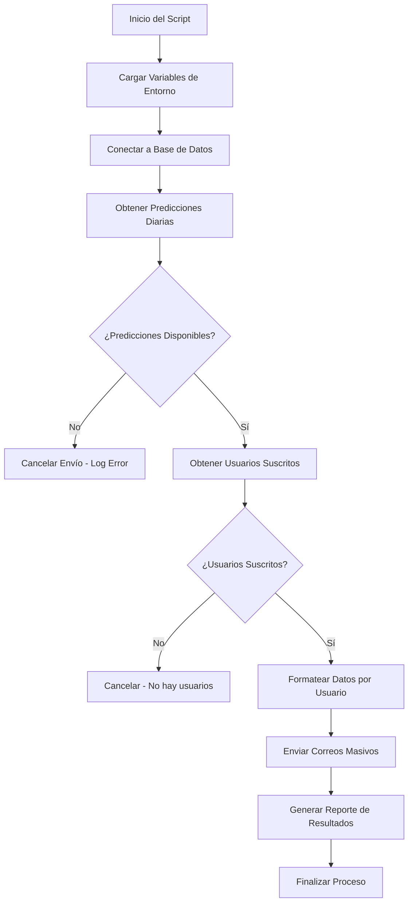

# DOCUMENTACIÓN SEND_DAILY_PREDICTIONS.js

## 📧 Sistema de Notificaciones Diarias de Predicciones PM2.5

### Descripción General

El script `scripts/cron/send_daily_predictions.js` es un sistema automatizado de notificaciones por correo electrónico que envía predicciones diarias de calidad del aire (PM2.5) a usuarios suscritos. Se ejecuta automáticamente cada día a las 06:00 AM UTC (08:00 AM hora española) como parte del sistema cron de Air Gijón.

### 🎯 Objetivo Principal

Mantener informados a los usuarios de Air Gijón sobre las predicciones de calidad del aire para el día actual y el siguiente, enviando correos electrónicos personalizados con:

- Predicción de PM2.5 para hoy (horizonte 0 días)
- Predicción de PM2.5 para mañana (horizonte 1 día) 
- Clasificación de calidad del aire según estándares OMS
- Recomendaciones de salud basadas en los niveles predichos

### 🏗️ Arquitectura del Sistema

#### Componentes Principales

1. **Script Principal**: `scripts/cron/send_daily_predictions.js`
2. **Servicio de Email**: `src/services/email_service.js`
3. **Base de Datos**: Conexión a PostgreSQL
4. **Plantillas HTML**: Templates responsivos para emails

#### Flujo de Ejecución



### 🔧 Funciones Principales

#### 1. `getDailyPredictions()`

**Propósito**: Obtiene las predicciones de PM2.5 para hoy y mañana desde la base de datos.

**Proceso**:
- Calcula fechas para hoy y mañana
- Consulta tabla `predicciones` con filtros:
  - Parámetro: `pm25`
  - Modelo activo: `true`
  - Horizontes: 0 días (hoy) y 1 día (mañana)
- Valida que existan ambas predicciones
- Retorna datos estructurados con valores redondeados

**Query SQL**:
```sql
SELECT 
  p.fecha,
  p.valor,
  p.horizonte_dias,
  m.nombre_modelo
FROM predicciones p
JOIN modelos_prediccion m ON p.modelo_id = m.id
WHERE p.fecha >= $1 
  AND p.parametro = 'pm25'
  AND m.activo = true
  AND p.horizonte_dias IN (0, 1)
ORDER BY p.horizonte_dias ASC
```

**Retorno**:
```javascript
{
  hoy: {
    fecha: "2025-06-16",
    valor: 25,
    modelo: "LightGBM_v2",
    horizonte_dias: 0
  },
  manana: {
    fecha: "2025-06-17", 
    valor: 30,
    modelo: "LightGBM_v2",
    horizonte_dias: 1
  }
}
```

#### 2. `sendDailyPredictionEmails()`

**Propósito**: Función principal que orquesta todo el proceso de envío.

**Proceso**:
1. Obtiene predicciones llamando a `getDailyPredictions()`
2. Obtiene usuarios suscritos a `daily_predictions` 
3. Formatea datos personalizados para cada usuario
4. Delega envío masivo a `sendDailyPredictions()`
5. Procesa resultados y genera reporte final
6. **NUEVO**: Envía reporte automático al administrador (`airgijon@gmail.com`)

**Gestión de Errores**:
- Valida disponibilidad de predicciones
- Verifica existencia de usuarios suscritos
- Captura y reporta errores de envío individual
- Continúa procesamiento aunque falle algún envío
- **NUEVO**: Envía reportes de error al administrador en todos los escenarios

### 📊 Base de Datos

#### Tablas Involucradas

**predicciones**:
- Almacena predicciones de ML para diferentes horizontes
- Filtro por `parametro = 'pm25'` y `horizonte_dias IN (0,1)`

**users** (via `getUsersForDailyPredictions()`):
- Usuarios con `daily_predictions = true`
- Contiene `email`, `name`, `id` para personalización

**modelos_prediccion**:
- Metadatos de modelos ML activos
- `nombre_modelo`, `roc_index` para contexto

#### Configuración de Suscripción

Los usuarios pueden gestionar sus preferencias desde:
- Panel de administración (admin)
- Página de cuenta personal
- Columna `daily_predictions` en tabla `users`

### 📧 Sistema de Email

#### Configuración SMTP

**Variables de Entorno Requeridas**:
```env
EMAIL_USER=tu-gmail@gmail.com
EMAIL_PASS=app-password-gmail
EMAIL_FROM=noreply@air-gijon.es
FRONTEND_URL=https://air-gijon-front-end.onrender.com
```

**Proveedor**: Gmail SMTP
**Puerto**: 587 (TLS)
**Autenticación**: App Password (no contraseña normal)

#### Plantilla de Email

**Características**:
- Diseño responsive y profesional
- Colores corporativos de Air Gijón
- Logo dinámico desde frontend
- Badges de estado color-coded
- Links a aplicación web

**Elementos Visuales**:
- **Header**: Logo + título personalizado
- **Contenido**: Dos tarjetas de predicción (hoy/mañana)  
- **Métricas**: Valor numérico + unidad (µg/m³)
- **Estados**: Badges coloreados según clasificación OMS
- **Recomendaciones**: Texto dinámico según nivel PM2.5
- **Footer**: Enlaces de gestión + disclaimer

#### Clasificación de Estados PM2.5

Según estándares de la OMS:

| Rango (µg/m³) | Estado | Color | Recomendación |
|---------------|---------|-------|---------------|
| ≤ 15 | Buena | Verde | Sin restricciones |
| 16-25 | Moderada | Amarillo | Vigilar síntomas sensibles |
| 26-50 | Regular | Naranja | Reducir ejercicio intenso |
| > 50 | Mala | Rojo | Evitar actividades exteriores |

### ⚡ Ejecución y Automatización

#### Comando Manual
```bash
node scripts/cron/send_daily_predictions.js
```

#### Configuración Cron (Render)
- **Horario**: 06:00 AM UTC diario
- **Equivalencia España**: 08:00 AM (zona ideal para usuarios)
- **Servicio**: `email-predictions` en Render
- **Dependencia**: Debe ejecutarse después de `daily-predictions` (05:30 AM)

#### Variables de Entorno
- Carga automática desde `config/.env_local`
- Fallback a variables de sistema en producción
- Validación de credenciales antes de envío

### 📈 Logging y Monitoreo

#### Logs Detallados

**Inicio de Proceso**:
```
🌅 Iniciando envío de predicciones diarias...
📅 Obteniendo predicciones para hoy (2025-06-16) y mañana (2025-06-17)
📧 Enviando a 15 usuarios suscritos...
```

**Errores de Predicciones**:
```
❌ No se encontraron predicciones suficientes. Encontradas: 1/2
   - Fecha: 2025-06-16, Horizonte: 0, Valor: 25
❌ No se encontraron predicciones para ambos horizontes
```

**Resumen Final**:
```
📊 Resumen del envío:
   ✅ Exitosos: 14
   ❌ Fallidos: 1  
   📧 Total: 15

❌ Errores detectados:
   usuario@email.com: Connection timeout

📧 Enviando reporte al administrador...
✅ Reporte de administrador enviado
```

#### 📧 Reporte de Administrador

**NUEVA FUNCIONALIDAD**: El sistema envía automáticamente un reporte detallado a `airgijon@gmail.com` después de cada ejecución.

**Contenido del Reporte**:
- **Fecha y tiempo de ejecución**
- **Predicciones enviadas** (valores hoy/mañana + modelo)
- **Resultados del envío** (total, exitosos, fallidos, tasa de éxito)
- **Lista detallada de errores** (si los hay)
- **Estado visual** (verde para éxito, amarillo para advertencias)

**Escenarios de Reporte**:
1. **Éxito completo**: Reporte verde con estadísticas
2. **Éxito parcial**: Reporte amarillo con errores específicos
3. **Sin usuarios**: Reporte informativo
4. **Sin predicciones**: Reporte de error del sistema
5. **Error crítico**: Reporte de error con stack trace

#### Tracking de Notificaciones

Cada email enviado se registra en `notification_logs`:
- `user_id`, `type = 'daily_prediction'`
- `email`, `subject`, `content` 
- `status = 'sent'`, `timestamp`
- Control anti-spam automático

### 🛠️ Mantenimiento y Solución de Problemas

#### Problemas Comunes

**1. Faltan Predicciones**
- **Causa**: Fallo en script `daily_predictions.py`
- **Solución**: Verificar ejecución previa, ejecutar manualmente
- **Prevención**: Alertas de monitoreo para cron jobs

**2. No hay Usuarios Suscritos**
- **Causa**: Todos los usuarios desactivaron `daily_predictions`
- **Solución**: Verificar tabla `users`, promover suscripciones
- **Prevención**: Dashboard de métricas de suscripción

**3. Errores de Email**
- **Causa**: Credenciales inválidas, límites de Gmail
- **Solución**: Regenerar App Password, verificar cuotas
- **Prevención**: Implementar retry logic y proveedores backup

#### Comandos de Diagnóstico

**Verificar Predicciones Disponibles**:
```sql
SELECT fecha, valor, horizonte_dias 
FROM predicciones 
WHERE parametro = 'pm25' 
  AND fecha >= CURRENT_DATE 
  AND horizonte_dias IN (0,1)
ORDER BY horizonte_dias;
```

**Verificar Usuarios Suscritos**:
```sql
SELECT COUNT(*) as total_suscritos 
FROM users 
WHERE daily_predictions = true 
  AND email_confirmed = true;
```

**Verificar Logs de Envío**:
```sql
SELECT user_id, status, created_at 
FROM notification_logs 
WHERE type = 'daily_prediction' 
  AND DATE(created_at) = CURRENT_DATE
ORDER BY created_at DESC;
```

### 🔄 Flujo de Integración

#### Dependencias del Sistema

1. **Predicciones ML**: Requiere datos de `daily_predictions.py`
2. **Usuarios Activos**: Requiere gestión de suscripciones
3. **Configuración Email**: Requiere credenciales válidas
4. **Frontend**: URLs dinámicas para enlaces en emails

#### Sincronización con Otros Procesos

- **05:30 AM**: `daily-predictions` (generación de predicciones)
- **06:00 AM**: `send_daily_predictions` (envío de emails)
- **Cada hora :05**: `email-alerts` (alertas puntuales)

### 📋 Checklist de Despliegue

- [ ] Variables de entorno configuradas
- [ ] Credenciales Gmail válidas y App Password generado
- [ ] Base de datos accesible y tablas actualizadas
- [ ] Usuarios de prueba suscritos a `daily_predictions`
- [ ] Cron job configurado en Render
- [ ] Monitoreo de logs activado
- [ ] Frontend desplegado para enlaces dinámicos

### 🚀 Roadmap de Mejoras

#### Mejoras Planificadas

1. **Retry Logic**: Reintentos automáticos para envíos fallidos
2. **Múltiples Proveedores**: Backup SMTP para alta disponibilidad  
3. **Personalización Avanzada**: Horarios de envío por usuario
4. **Rich Content**: Gráficos embebidos, mapas de calor
5. **A/B Testing**: Optimización de templates y horarios
6. **Push Notifications**: Alternativa móvil a emails

#### Optimizaciones Técnicas

1. **Batch Processing**: Envío en lotes para gran volumen
2. **Template Caching**: Cache de plantillas para mejor performance
3. **Database Pooling**: Optimización de conexiones DB
4. **Async/Await**: Paralelización de envíos independientes

---

## 📞 Soporte

Para problemas o dudas sobre el sistema de notificaciones:
- **Logs**: `/Users/sergio/projects/air-gijon/logs/`
- **Configuración**: `config/.env_local`
- **Documentación**: Este archivo + `desarrollo_modelos_prediccion/prompt_contexto_air_gijon.md` 